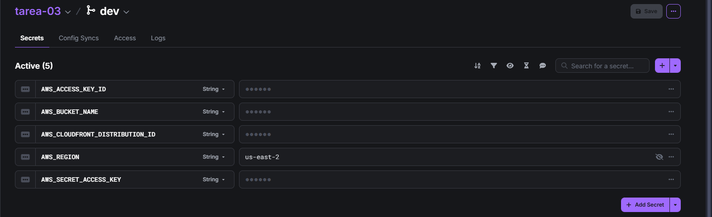
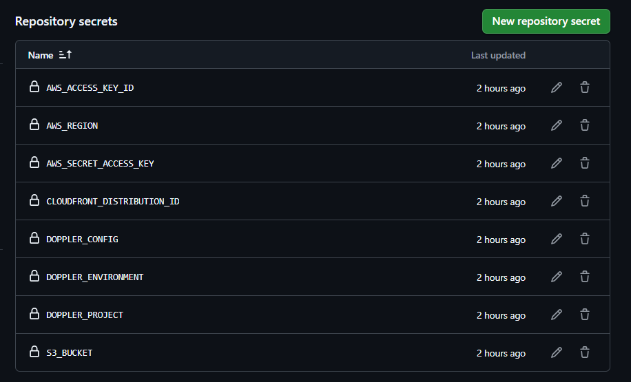
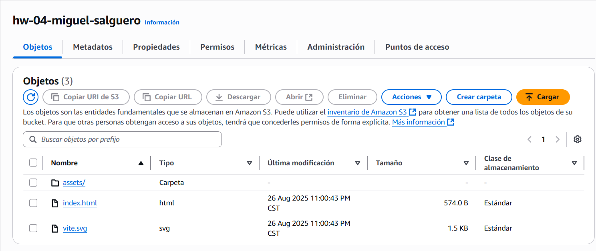

# HW-04 - To-Do Application

This project shows a modern To-Do application with task management features and cloud deployment.

---

## Doppler Integration

  
This screenshot shows the environment variables saved in Doppler for secure credential management.

---

## GitHub Actions Workflow

  
This screenshot shows the GitHub Actions pipeline configuration for automated deployment.

---

## Build Output

  
This screenshot shows the dist folder generated by running npm run build, ready for deployment to AWS S3.

---

## CloudFront Deployment

This is the public URL of the CloudFront CDN where the application is deployed and accessible.
- https://d3tgg94i097200.cloudfront.net/index.html

---

## React Hooks Overview

### useState - State management
- Keeps data that changes, like the list of tasks.  
- Every time the state changes, the component renders again.  

---

### useEffect - Side effects
- Runs code after the component renders.  
- Used here to save the tasks in the browser localStorage.  

---

### useCallback - Optimize functions
- Stops functions from being recreated on every render.  
- Helps the app run faster and more efficient.  

---

### useMemo - Optimize calculations
- Saves the result of calculations.  
- Only recalculates when the data changes, for example to check overdue tasks.  

---

### Custom Hook (useLocalStorage) - Reusable logic
- Wraps the logic of localStorage in one place.  
- Makes components cleaner and allows reusing the same logic.  
