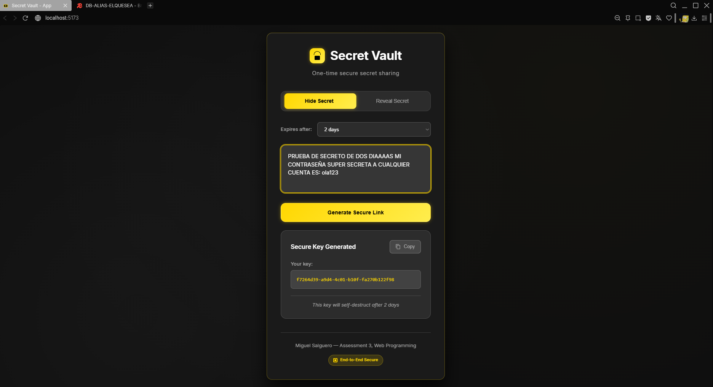
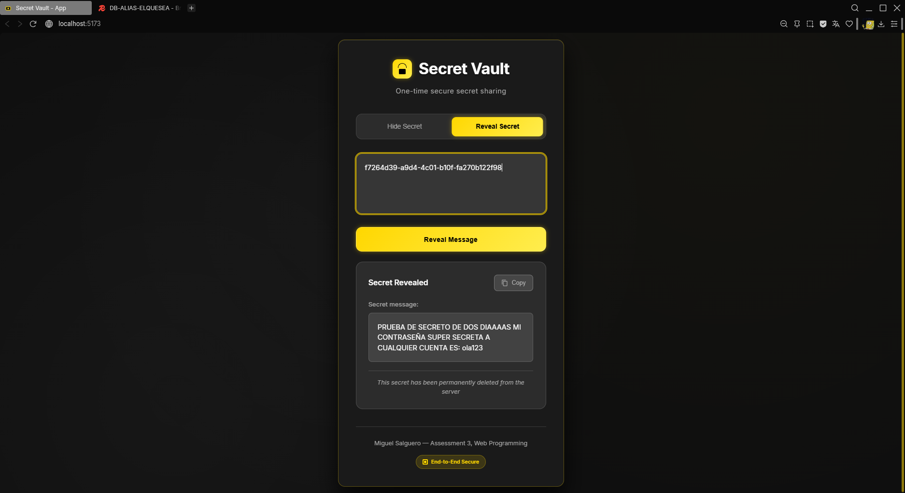
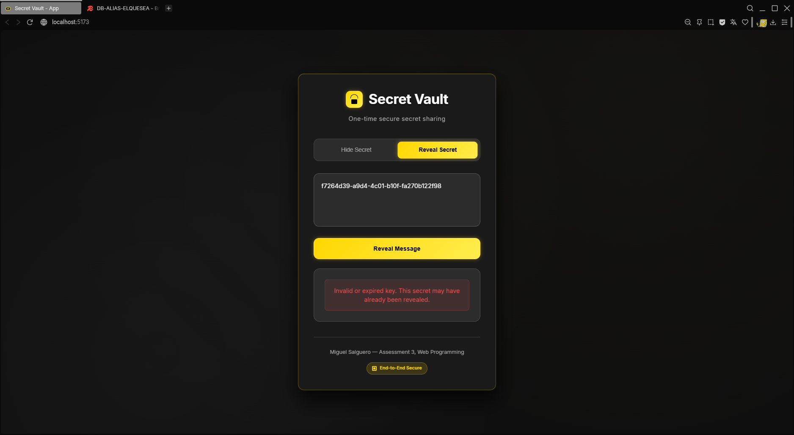
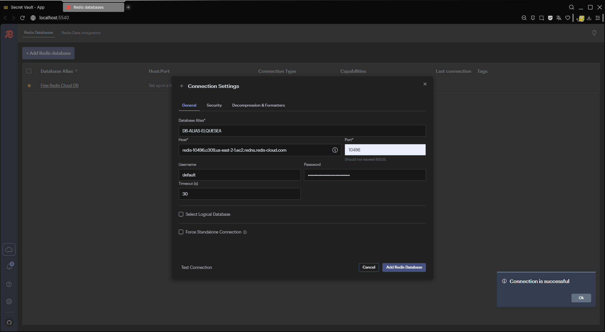
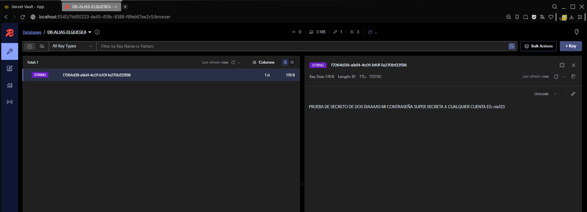
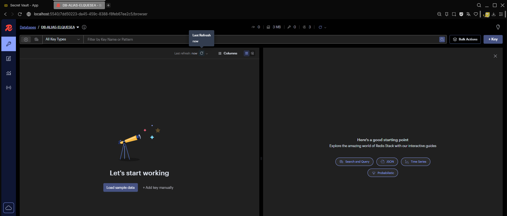

# Secret Vault - Secure One-Time Secret Sharing

A web application for sharing secrets securely through one-time use links. Messages self-destruct after being revealed.

This project is part of the third exam for Web Programming course.

**Development Environment**: Windows
> **Note**: If anything doesn't work correctly, please let me know and I'll fix it as soon as possible

## Features

- **One-time security**: Each secret can only be accessed once
- **Automatic expiration**: Secrets expire after configured time (by the user)
- **Modern interface**: Clean design with React and TypeScript
- **Container architecture**: Simplified deployment with Docker
- **Persistence**: Secret data stored in database
- **Visualization**: Tools for monitoring the database

## Technology Stack

### Backend
- Django 5.2.7 - Python web framework
- Django REST Framework - REST API
- Redis - Temporary secret storage
- SQLite - Database for metadata

### Frontend
- React 19 - UI library
- TypeScript - Typed JavaScript
- Vite - Build tool and dev server
- Axios - HTTP client

### Infrastructure
- Docker - Containers
- Docker Compose - Orchestration
- RedisInsight - Redis visualization

## Quick Installation and Setup

### Prerequisites
- Docker
- Docker Compose

### Steps to Run

1. **Clone the repository**

   git clone <repository-url>

2. **Set up environment variables**
   
   Create a `.env` file in the project root with the following content:

    DJANGO_SECRET_KEY=supersecretkey123
    DJANGO_DEBUG=True
    DJANGO_ALLOWED_HOSTS=*

    REDIS_HOST=redis-10496.c309.us-east-2-1.ec2.redns.redis-cloud.com
    REDIS_PORT=10496
    REDIS_PASSWORD=OlDbAxn1JcQNtW7rkInbyRF9HSuvEo3B

    VITE_API_URL=http://localhost:8000
    VITE_FRONTEND_URL=http://localhost:5173

3. **Run the application**

   docker compose up --build

4. **Wait for startup completion**
   
   After all services are running, you will see this message:

   ==========================================
   SECRET VAULT APPLICATION
   ==========================================
   APPLICATION URLs:
     Frontend: http://localhost:5173
     Backend API: http://localhost:8000
     RedisInsight: http://localhost:5540

   SERVICES STATUS:
     React Frontend: Running
     Django Backend: Running
     Redis Database: Running
     RedisInsight: Running
   ==========================================

## Access the Application

- **Frontend**: http://localhost:5173
- **Backend API**: http://localhost:8000
- **RedisInsight**: http://localhost:5540

## Database Setup and Testing

### RedisInsight Configuration

To test and monitor of Redis database (using redis insight):

1. Open RedisInsight at http://localhost:5540
2. Click "Add Redis Database"
3. Go to "Connection Settings"
4. Configure connection:
   - **Database Alias**: (it can be anything)
   - **Host**: redis-10496.c309.us-east-2-1.ec2.redns.redis-cloud.com
   - **Port**: 10496
   - **Username**: default (leave as is)
   - **Password**: OlDbAxn1JcQNtW7rkInbyRF9HSuvEo3B
5. Click "Test Connection" to verify
6. Click "Add Redis Database" to save

### Testing the Database

After connecting to RedisInsight:

- Go to the database tab (with the database alias)
- You should see Redis keys appear when secrets are created
- Keys will automatically disappear when secrets are revealed or expire
- Monitor real-time data flow as user create and access secrets

## Using the Application

### Hide a Secret

1. Select "Hide Secret"
2. Choose expiration time (1 hour to 30 days)
3. Write your secret message
4. Click "Generate Secure Link"
5. Copy the generated key and share it

### Reveal a Secret

1. Select "Reveal Secret"
2. Paste the received key
3. Click "Reveal Message"
4. The message will show and then permanently delete

## API Reference

### Hide Secret

POST /api/hide/
Content-Type: application/json

{
  "secret": "string",
  "ttl_hours": number
}

**Response:**

{
  "key": "uuid-string"
}

### Reveal Secret

POST /api/reveal/
Content-Type: application/json

{
  "key": "uuid-string"
}

**Response:**

{
  "secret": "string"
}

## Development

### Run in Development Mode

**Backend:**

cd backend
python -m venv venv
source venv/bin/activate  # Windows: venv\Scripts\activate
pip install -r requirements.txt
python manage.py runserver

**Frontend:**

cd frontend
npm install
npm run dev

### Useful Commands

**Create migrations:**

docker compose exec backend python manage.py makemigrations

**Apply migrations:**

docker compose exec backend python manage.py migrate

## Stopping the Application

To stop all services, press `Ctrl+C` in the terminal where docker compose is running, or run:

docker compose down

### Current Implementation
- Secrets are stored in plain text in Redis for educational purposes but in a real case this obviously needs encryptation
- Metadata (keys, timestamps, IPs) is stored in SQLite
- The application demonstrates one-time access patterns and automatic expiration

## Security Architecture

- **Single read**: Secrets delete from Redis after being accessed
- **Temporal expiration**: Configurable TTL 
- **Unique UUIDs**: Impossible-to-guess keys
- **No persistence**: Secrets never saved in persistent databases

## Application Screenshots

## Application Screenshots

### Hide Secret Interface

*Create a new secret with customizable expiration time (1 hour to 30 days)*

### Reveal Secret Interface  

*Retrieve a secret using the generated unique key - message self-destructs after viewing*

### Invalid Key Handling

*User-friendly error message for expired or invalid keys*

### RedisInsight Configuration

*Setting up Redis database connection in RedisInsight (localhost:5540) — Use the credentials provided above in the `.env` section*

### Database Monitoring

*Real-time monitoring showing active secrets in Redis - keys automatically disappear after access or expiration*

### Empty Database State

*Database state after secret has been accessed and automatically deleted*

## Author

Miguel Salguero  
Assessment 3 - Web Programming  
URL 2025

## License

This project is for educational purposes.

---

**Note**: The application uses Redis Cloud for database services. All secrets are stored temporarily and automatically deleted after access or expiration 