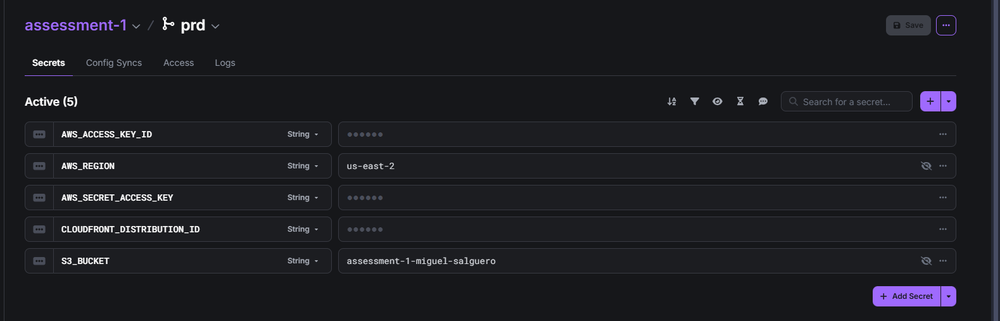
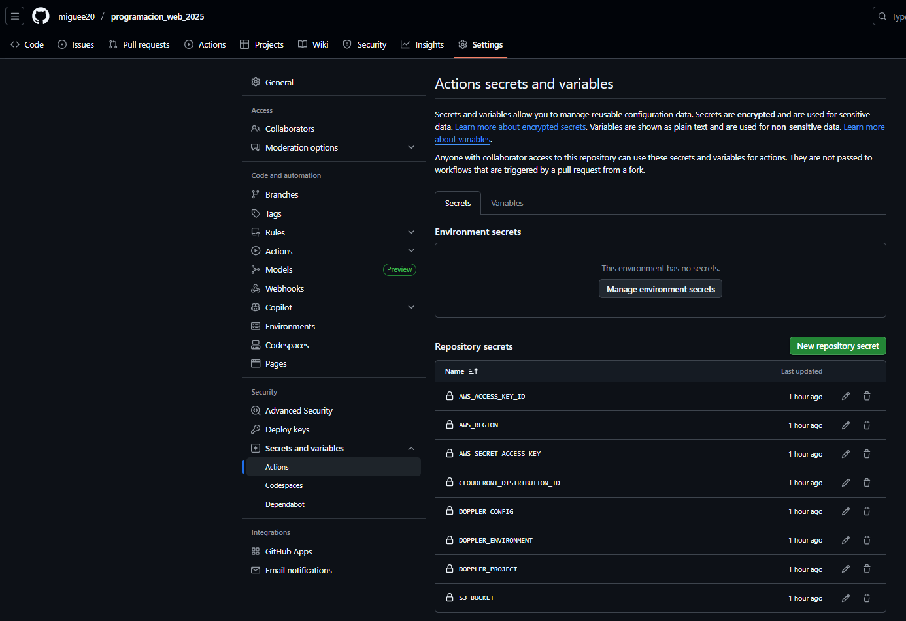
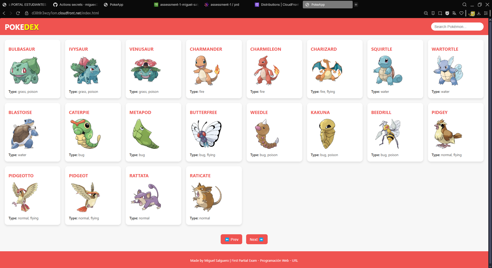
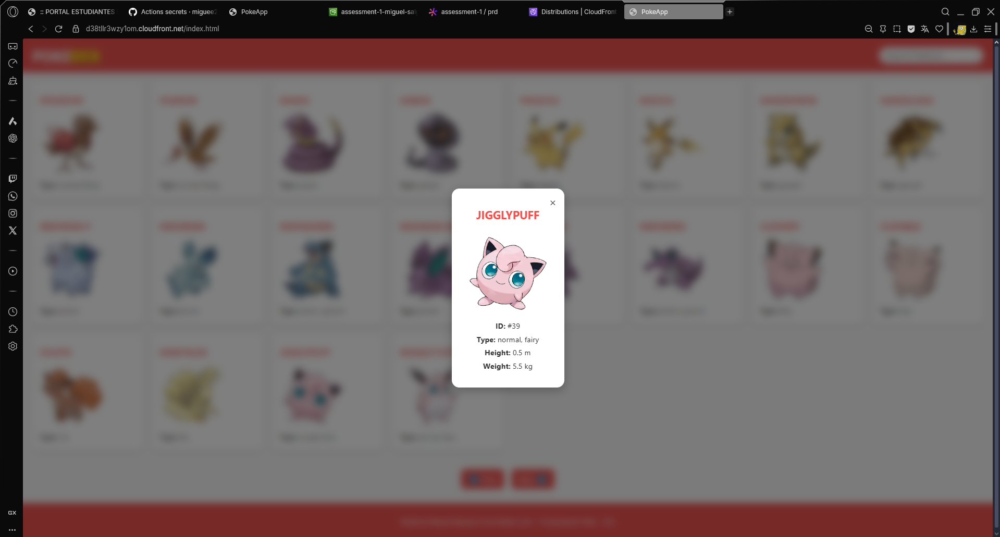
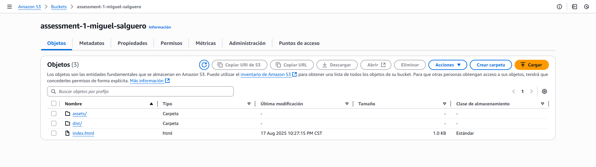

# Assessment 1 - PokeAPI Application

This assessment demonstrates the use of the PokeAPI and shows how the application is connected and deployed.

---

### Doppler Config Syncs
  
This screenshot shows the "Config Syncs" tab in Doppler, demonstrating the integration with the repository.

---

### Doppler Environment Variables
  
Here you can see the environment variables saved in Doppler. The actual values are hidden for security.

---

### GitHub Secrets
  
This screenshot shows the secrets configured in GitHub for the project.

---

### PokeAPI Application - Pokémon Cards
  
This image shows the application displaying Pokemon cards fetched from the PokeAPI.

---

### PokeAPI Application - Pokémon Details
  
Here you can see what happens when you click on a Pokemon

---

### CloudFront Bucket - Build Files
  
This screenshot shows the `dist` folder and other necessary files generated by running `npm run build` and uploaded to CloudFront

---

### CloudFront URL
[https://d38tllr3wzy1om.cloudfront.net/index.html](https://d38tllr3wzy1om.cloudfront.net/index.html)  
This is the public URL of the CloudFront CDN where the application can be accessed.
