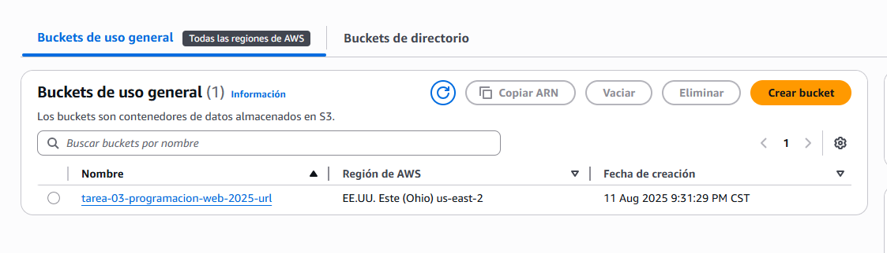
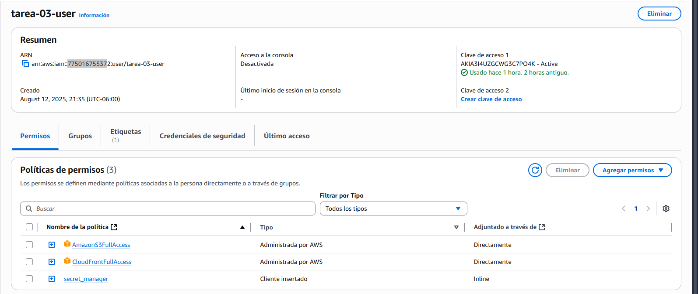
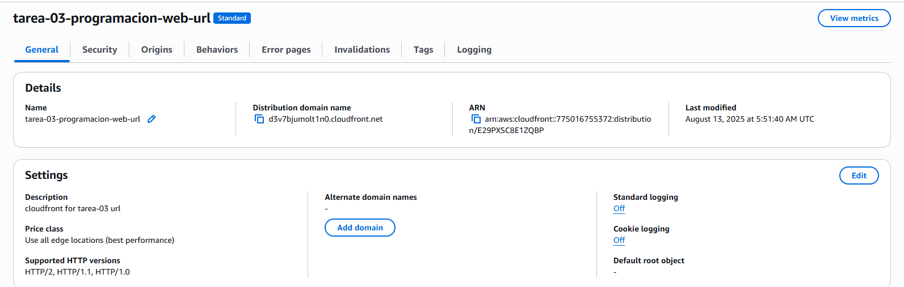
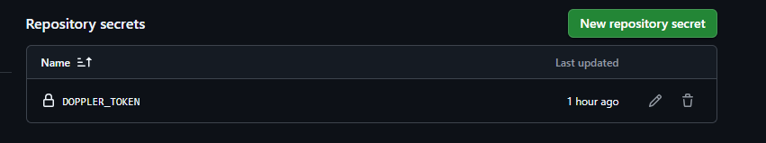

# programacion_web_2025_tarea_03
# AWS Deployment Overview

Here is a visual overview of the steps I took while trying to deploy this project on AWS  

---

### S3 Bucket Creation
  
This screenshot shows that the S3 bucket was successfully created

---

### IAM User Creation
  
Here we can see that an IAM user was created to connect with AWS

---

### CloudFront Distribution
  
This image shows the CloudFront setup

---

### Doppler Environment Variables
  
Here is the environment variables saved in Doppler

---

### GitHub Secrets
  
This screenshot shows the GitHub secrets configuration

---

### CloudFront URL
[https://d3v7bjumolt1n0.cloudfront.net](https://d3v7bjumolt1n0.cloudfront.net)  
I tried accessing the CloudFront URL after setting up the distribution, but it didn't work :(((  
Honestly, I'm not really sure what went wrong, maybe something with AWS, maybe with Doppler, or maybe just me being confused :(  

Most of the setup was done, like creating the S3 bucket, setting up the IAM user, and saving the environment variables in Doppler.  
Even though the URL isn’t working, this kind of homework really helped me understand how AWS services connect and what it takes to deploy a project, sooo I learned a lot, even if the final connection didn’t actually work :)

