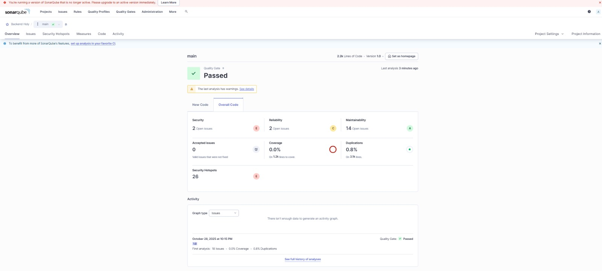

# Assignment 08 - SonarQube

## Configuration

SonarQube was configured using Docker Compose in the `sonar/` folder.

## Execution

- Start SonarQube: `cd sonar` and `docker-compose up -d`
- Scan backend: `cd backend` and `sonar-scanner -Dsonar.host.url=http://localhost:9000 -Dsonar.login=TOKEN`
- Scan frontend: `cd frontend` and `sonar-scanner -Dsonar.host.url=http://localhost:9000 -Dsonar.login=TOKEN`

## Results

### Backend

- Quality Gate: Passed
- Security: 2 issues
- Security Hotspots: 26
- Reliability: 2 issues
- Maintainability: 14 issues
- Coverage: 0.0%

### Frontend

- Quality Gate: Passed
- Security: 0 issues
- Reliability: 21 issues
- Maintainability: 12 issues
- Coverage: 0.0%